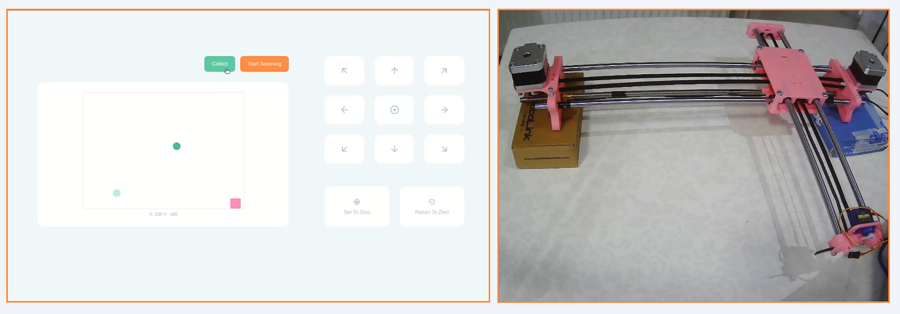
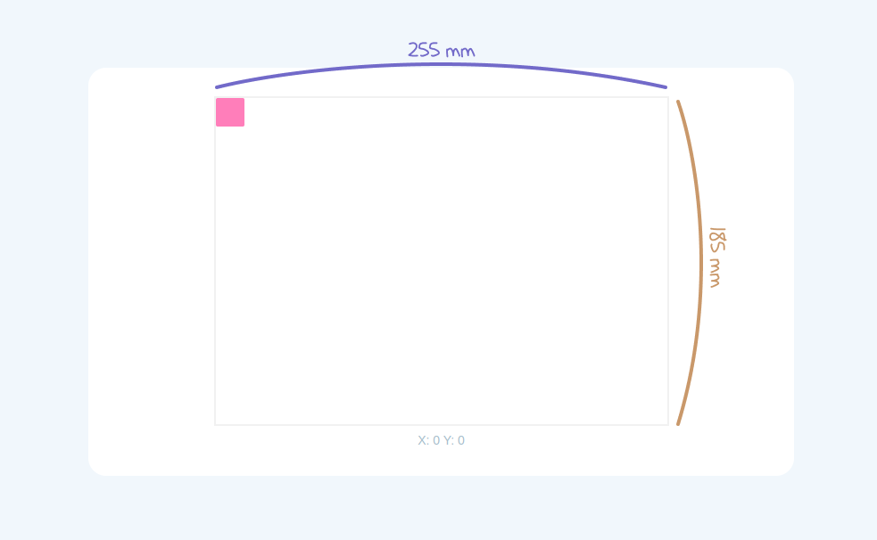

# Metal Collector

| This is a hardware-based web application made for the "Introduction to Robotics" course. If you want to **_completely_** run this web application, you will need to have the hardware part of this project. So, do not forget to check the [**_hardware requirements_**](#hardware-requirements) below in case you want to completely use it. |
| :-------------------------------------------------------------------------------------------------------------------------------------------------------------------------------------------------------------------------------------------------------------------------------------------------------------------------------------------- |

## Introduction

Metal Collector is an industrial robot project for collecting metals from a surface via a web application. It is possible to examine this project under two main parts: detecting the metals and collecting the metals.

#### 1. Detecting the metals

First of all, the robot has to scan all over the workspace to discover the positions of the metals. In order to do this, normally you will need to use a sensor called `inductive sensor`. Using an inductive sensor it is possible to determine whether an object is a metal or not. However, since I did not use one, I just skipped this detecting part by "mocking" the use of the inductive sensor. I have basically created a "dummy" JSON file that includes the detected metals with their positions on the workspace. You can find this file at `server/src/fake-data/dummy-metals.json`. So, you need to keep in mind that this project just assumes that there are a few metals at the pre-specified positions.

#### 2. Collecting the metals

After the scanning process, you will see the detected (fake) metals on the web interface according to their detected positions. By collecting them through the web interface you will no longer see them on the workspace screen. Of course, it is possible to collect real metals if you use an `electromagnet` on the robot. However, I just simulated this action since I did not use one.

(See the [usage section](#usage) to learn more.)

<p  align="center">
	
	<b>Image:</b> Web App and Robot
</p>

### Table of Contents

- [Introduction](#introduction)
- [Requirements](#requirements)
  - [Hardware requirements](#hardware-requirements)
  - [Software requirements](#software-requirements)
- [Installation](#installation)
  - [Setting up the robot](#setting-up-the-robot)
  - [Firmware installation for Arduino](#firmware-installation-for-arduino)
  - [Editing the config.json file](#editing-the-configjson-file)
  - [Installing the dependencies and running the application](#installing-the-dependencies-and-running-the-application)
    - [Server](#server)
    - [Client](#client)
- [Usage](#usage)
  - [Controlling the robot movement](#controlling-the-robot-movement)
  - [Set to Zero and Return to Zero](#set-to-zero-and-return-to-zero)
  - [Moving to a specific position](#moving-to-a-specific-position)
  - [Scanning and collecting the metals](#scanning-and-collecting-the-metals)
- [Technologies](#technologies)
  - [Server](#server-1)
  - [Client](#client-1)
  - [Arduino](#arduino)
- [Important notes](#important-notes)
- [License](#license)

## Requirements

### Hardware Requirements

For the mechanical part of this project, I based a `drawing robot` project. So, if you want to build the same robot, please take a look at [this thing](https://www.thingiverse.com/thing:2349232) for the needed materials.

### Software Requirements

- [Arduino IDE](https://www.arduino.cc/en/software) - Just needed for flashing `grbl` to Arduino
- [grbl](https://github.com/grbl/grbl) - Required for robot movement
- [Node.js](https://nodejs.org) - I recommend you to use the up-to-date version

## Installation

### Setting up the robot

You can follow [this amazing guide](https://test3dprints.com/arduino/homework-writing-machine) to setup the mechanical part step by step.

### Firmware installation for Arduino

You need to flash `grbl` to your Arduino. If you don't have an idea about how to do this, you can [take a look at this official wiki page](https://github.com/grbl/grbl/wiki/Compiling-Grbl).

### Editing the config.json file

You can edit the config.json file to change the default settings. In order to do this go to `server/src/config.json`.

```json
{
  "port": "/dev/ttyUSB0",
  "stepSize": "20",
  "feedRate": "10000",
  "xMax": "255",
  "xMin": "0",
  "yMax": "0",
  "yMin": "-185"
}
```

- **port:** Specify the port your Arduino is connected to. _(Launch the Arduino IDE and then, from the drop-down menu navigate to `Tools > Port` to see the connected port)_.
- **stepSize:** The amount of how many millimeters it will move in each step when using the control buttons.
- **feedRate:** Movement speed _(10000 is recommended)_.
- **xMax:** The maximum position (in mm) the robot can go on the x-axis _(Should be determined by how far the robot can physically move)_.
- **xMin:** The minimum position (in mm) the robot can go on the x-axis _(0 is recommended)_.
- **yMax:** The maximum position (in mm) the robot can go on the y-axis _(0 is recommended)_.
- **yMin:** The minimum position (in mm) the robot can go on the y-axis _(Should be determined by how far the robot can physically move)_.

(**Note:** Do not be confused by the negative sign in `yMin` value. You should consider the coordinate system.)

According to your limit configurations on the `config.json` file, you will have the specified borders for the robot's workspace.

For example, if you use the default configurations for the maximum and minimum values of x - y axises, you will have the following workspace:

<p  align="center">
	
</p>

This is important in order to prevent the robot from physically moving out of the workspace and to display an error message for movements that may cause this.

### Installing the dependencies and running the application

Before cloning this repo, it is worth mentioning that if you clone this repo from the `main` branch, you will download the relatively large image files in the README.md. So, you can use the `development` branch to download source code without README.md and images.

To clone from the `development` branch:

```bash
$ git clone -b development --single-branch git@github.com:idnzozkan/metal-collector.git
```

#### Server

1 - Open your terminal and navigate to the `server` folder

```bash
$ cd server
```

2 - Install dependencies via npm

```bash
$ npm install
```

3 - Run the server by using the following command

```bash
$ npm start
```

#### Client

1 - Open your terminal and navigate to the `client` folder

```bash
$ cd client
```

2 - Install dependencies via npm

```bash
$ npm install
```

3 - Run the client by using the following command

```bash
$ npm start
```

After that, you should be able to see the app at [http://localhost:3000](http://localhost:3000) in your browser.

## Usage

### Controlling the robot movement

Use the arrow buttons to move the robot in the direction you want.

<p  align="center">
	
</p>
 
### Set to Zero and Return to Zero

Use the `Set to Zero` button to define the physical location of the robot as the starting point (0, 0). After doing this, you should manually take your robot to the starting point. Otherwise, this action may cause the robot to exceed the workspace limits.

By using the `Return to Zero` button, you can move the robot to the starting point (0, 0).

<p  align="center">
	
</p>

### Moving to a specific position

By using the button at the center of the arrow buttons, you can move the robot to any point within the workspace borders.

<p  align="center">
	
</p>
  
### Scanning and collecting the metals

By clicking the Start Scanning button, you can let the robot move all over the workspace.

Normally, the algorithm that will run in the background of this process is:

1 - While the robot moving, get information on whether the objects are metal or not by using an inductive sensor.

2 - If a metal has been found at the current position, push the current location to the detectedMetals array.

3 - End the scanning process if the robot's position is at the end of the workspace.

However, since I did not use an inductive sensor, the algorithm working here is as follows:

1 - Try to find a metal from the [dummy-metals.json](https://github.com/idnzozkan/metal-collector/blob/main/server/src/fake-data/dummy-metals.json) file by comparing the current position of the robot and the positions of the metals in the [dummy-metals.json](https://github.com/idnzozkan/metal-collector/blob/main/server/src/fake-data/dummy-metals.json) file. If the current position and the metal position are equal, assign the corresponding metal to the foundMetal variable.

2 - If exists, push the foundMetal variable to the detectedMetals array.

3 - End the scanning process if the robot's position is at the end of the workspace.

After the scanning process is completed, you will see how many metals have been detected on the screen. Detected metals will also appear as green circles at their positions on the workspace.

To collect metals, first, click on the metal you want to collect, then click the Collect button that appears above to make the robot move to that position.

You can also add an `electromagnet` to this step to take the metal from the surface if you want. But this project does not include that functionality for now.

<p  align="center">
	
</p>

## Technologies

### Server

[Express.js](https://expressjs.com/), [Socket.IO](https://socket.io/), [gerbil-cnc](https://errantspark.github.io/gerbil-cnc/)

### Client

[React.js](https://reactjs.org/), [styled-components](https://styled-components.com/), [React-Toastify](https://fkhadra.github.io/react-toastify), [Axios](https://axios-http.com/), [Socket.IO](https://socket.io/)

### Arduino

[grbl](https://github.com/grbl/grbl)

## Important notes

After setting up the hardware part, I highly recommend you configure grbl by calibrating your robot. Please, read [this guide](https://howtomechatronics.com/tutorials/how-to-setup-grbl-control-cnc-machine-with-arduino/) or any other resource on the internet about it.

## License

MIT License

Copyright (c) 2021 Deniz Ozkan

Permission is hereby granted, free of charge, to any person obtaining a copy
of this software and associated documentation files (the "Software"), to deal
in the Software without restriction, including without limitation the rights
to use, copy, modify, merge, publish, distribute, sublicense, and/or sell
copies of the Software, and to permit persons to whom the Software is
furnished to do so, subject to the following conditions:

The above copyright notice and this permission notice shall be included in all
copies or substantial portions of the Software.

THE SOFTWARE IS PROVIDED "AS IS", WITHOUT WARRANTY OF ANY KIND, EXPRESS OR
IMPLIED, INCLUDING BUT NOT LIMITED TO THE WARRANTIES OF MERCHANTABILITY,
FITNESS FOR A PARTICULAR PURPOSE AND NONINFRINGEMENT. IN NO EVENT SHALL THE
AUTHORS OR COPYRIGHT HOLDERS BE LIABLE FOR ANY CLAIM, DAMAGES OR OTHER
LIABILITY, WHETHER IN AN ACTION OF CONTRACT, TORT OR OTHERWISE, ARISING FROM,
OUT OF OR IN CONNECTION WITH THE SOFTWARE OR THE USE OR OTHER DEALINGS IN THE
SOFTWARE.
